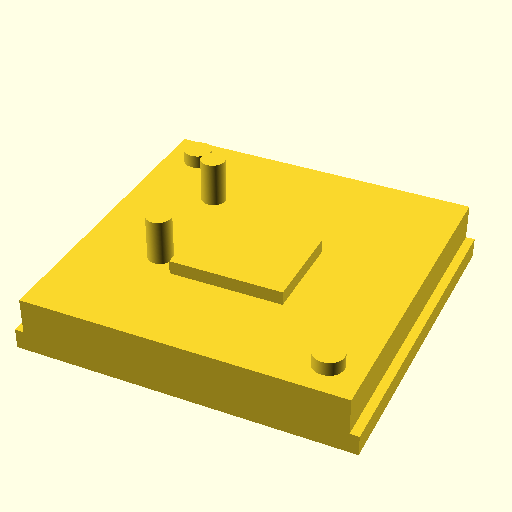

# key.scad

OpenSCAD library for mechanical keyboard switches and keycaps

## Cherry MX

## Kailh PG1280 KH Mid-height

## Kailh PG1350 Choc v1

## Kailh PG1353 Choc v2

## Kailh PG1425 X

## Gateron KS-33 Low Profile

